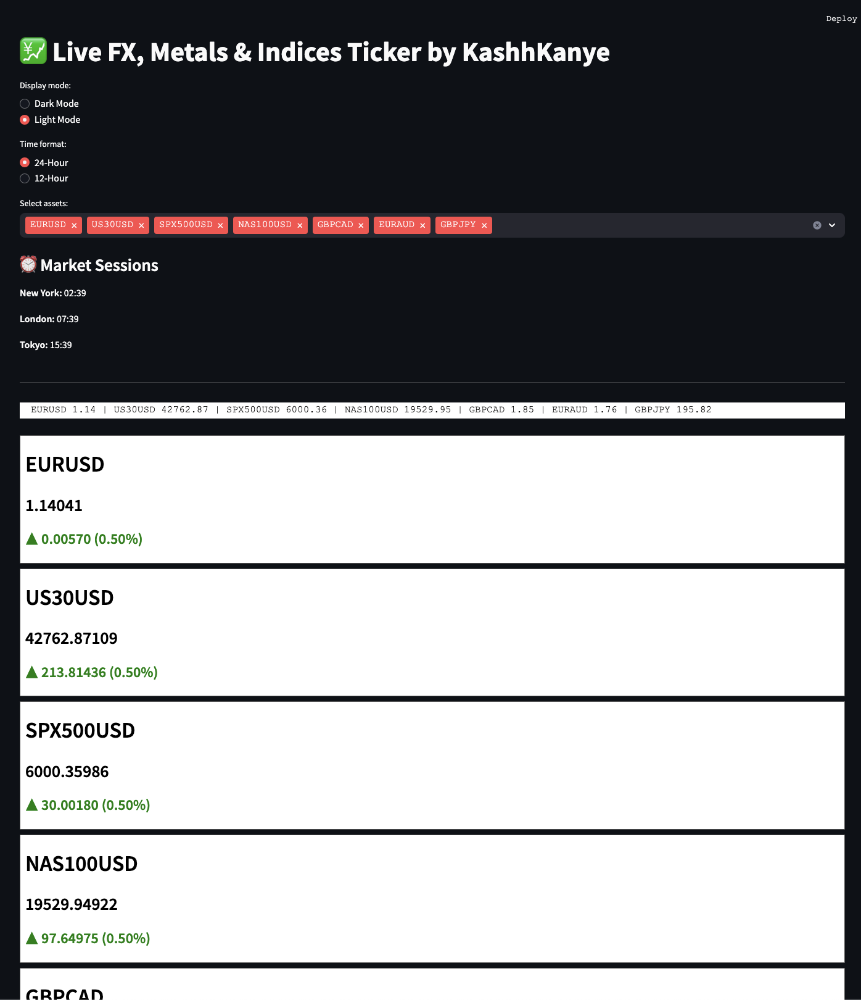

## 📺 Demo Preview


# 📈 Forex Ticker Display by KashhKanye

A real-time, stylized FX & Index ticker built in Python using Streamlit. Ideal for traders who want a fast, simple, and visually clean live quote dashboard.

---

## 🧩 Features

- Pulls **live Forex & metal prices** via [exchangerate.host](https://exchangerate.host)
- Supports **major indices** (US30, NAS100, SPX500)
- Auto-updating ticker every 5–60 seconds (adjustable)
- Select multiple FX pairs using checkboxes
- LED-style font display in **Dark/Light mode**
- Real-time **New York, London, Tokyo** market session clocks
- Directional arrows + % price change for clarity

---

## 🛠️ Getting Started (macOS)

### 1. Install Python 3 (if not installed)
Check version:
```bash
python3 --version
```
If not installed, install via:
```bash
brew install python
```

### 2. Create virtual environment and activate
```bash
python3 -m venv forex-env
source forex-env/bin/activate
```

### 3. Install required packages
```bash
pip3 install streamlit requests pytz pandas
```

### 4. Download or clone this repo
Move into the project folder:
```bash
cd ~/Downloads/forex-ticker
```

### 5. Run the application
```bash
streamlit run app.py
```

Visit `http://localhost:8501` in your browser.

---


---

## 📁 Project Structure

```
forex-ticker/
├── app.py         # Main Streamlit app
├── README.md      # This documentation
├── demo.png       # Optional screenshot or preview image
```

---

## ⚙️ Configuration & Customization

- **Theme toggle**: Choose Light/Dark mode at top
- **Time format**: Toggle 12h/24h clocks
- **Refresh rate**: Adjustable between 5 and 60 seconds
- **Pairs shown**: Select from over 30 currency/metals/index options

---

## ✅ Supported Symbols

```
FX Pairs: EURUSD, USDJPY, GBPUSD, AUDUSD, USDCHF, USDCAD, NZDUSD, EURJPY, GBPJPY, AUDJPY, CHFJPY, EURGBP, EURAUD, EURCHF, EURCAD, GBPCAD, AUDCAD, CADJPY, NZDJPY, USDHKD, USDMXN, USDZAR, USDNOK, USDSEK, USDSGD, USDTRY, USDINR, USDTHB

Metals: XAUUSD, XAGUSD

Indices: US30USD, NAS100USD, SPX500USD
```

---

## 💬 Notes

- Live FX prices are provided by exchangerate.host (no API key required).
- Index data is simulated or can be expanded using other APIs like yfinance if needed.
- Additions like charts, alerts, or webhook notifications can be layered in later versions.

---

## 📄 License


---
